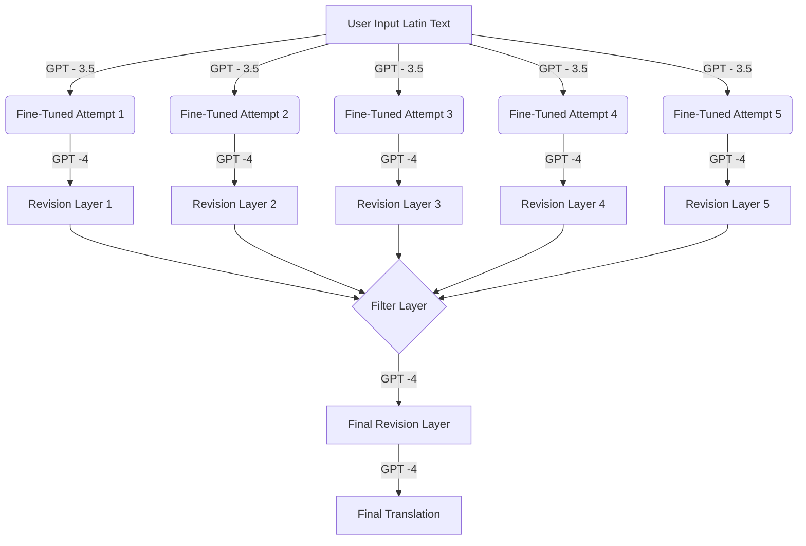

# Fine Tuned GPT 3.5 and GPT 4 based Latin Translator 

This is a Latin to English translator web interface that utilizes OpenAI's API to perform translations. This repository is made to be able to be easily installed and set up on any device locally and give access to the tool beyond the [website](https://translate.osmoslearn.com). By the nature of the translator, there are associated API costs to translating a given text. Because of the multiple layers of API calls in this model, the estimated cost lies at about $400 per million [tokens](https://platform.openai.com/tokenizer). On a small scale this cost is fairly insignicant, but keeping a website public for an extended period of time is not realistic as of now. This means to utilize this code, I've provided instructions to make an OpenAI account and have each user pay for their own usage and fine tune their own model. Don't worry this is made all very easy and should only take a few minutes. 

## Getting Started

These instructions will guide you through the setup process to get the translator running on your local machine for development, testing, and usage purposes.

### Prerequisites

To run this application, you will need:
- Node.js and npm
- Bun 
- An OpenAI account with an API key
- Potentially a Github account 

### Setting Up Your Environment

#### 1. Install Node.js and npm
- **Windows:**
  - Download the Node.js installer from [Node.js website](https://nodejs.org/en/download/)
  - Run the installer and follow the on-screen instructions.
- **Mac:**
  - You can install Node.js and npm using Homebrew. First, install Homebrew by opening Terminal and running the line below, [more details here](https://brew.sh).
    ```
    /bin/bash -c "$(curl -fsSL https://raw.githubusercontent.com/Homebrew/install/HEAD/install.sh)"
    ```
  - Then, install Node.js by running:
    ```
    brew install node
    ```

#### 2. Install [Bun]( https://bun.sh/docs/installation)
- **Windows:**
  Bun requires a minimum of Windows 10. 
  To install, paste this into a terminal:
   ```
  powershell -c "irm bun.sh/install.ps1|iex"
   ```
- **Mac:**
  - Open your terminal and run:
    ```
    curl -fsSL https://bun.sh/install | bash
    ```
  -  Follow the on-screen instructions to complete the installation.

### Downloading the Code
-It is possible to download the code as a ZIP file from the repository however, in my experience this tends to cause authentication issues. The preferable series of steps are as follows:

#### Creating a GitHub Account

If you do not already have a GitHub account, you will need to create one. Follow these steps:

1. Go to the [GitHub Sign Up page](https://github.com/join).
2. Fill out the form with your username, email address, and password.
3. Verify your account by following the instructions sent to your email.
4. Once your account is set up, you can proceed to clone the repository.

#### Setting Up an IDE
We recommend using Visual Studio Code (VSCode) as it is free, open-source, and supports a wide range of development activities.

- **Windows & Mac:**
1.  - Download and install VSCode from the [official website](https://code.visualstudio.com/Download).
2. Navigate to the Extensions view by clicking on the square icon on the sidebar or pressing `Ctrl+Shift+X`.
3. Search for the `GitHub Pull Requests and Issues` extension and install it.
4. Once installed, authenticate with GitHub by following the prompts which appear when you start a Git operation within VSCode.

### Cloning the Repository

To clone the repository using Visual Studio Code (VSCode), follow these steps:

1. **Open VSCode.**
2. **Access Command Palette:**
   - Go to the `View` menu and select `Command Palette`.
   - Type `Git: Clone` and press Enter.
3. **Enter Repository URL:**
   - Paste the repository URL `https://github.com/paulrosu11/Latin_Translator` when prompted.
4. **Choose Local Directory:**
   - Select a local directory where you want to clone the repository.
5. **Open Repository in VSCode:**
   - Once cloned, open the repository folder in VSCode.

Alternatively, you can clone the repository using the terminal:

1. **Open Terminal on Mac or PowerShell on Windows.**
2. **Navigate to Desired Directory:**
   - Use the `cd` command to navigate to the directory where you want to clone the repository.
3. **Clone Repository:**
   - Type the following command and press Enter:
     ```
     git clone https://github.com/paulrosu11/Latin_Translator.git
     ```
4. **Enter GitHub Credentials:**
   - If prompted, enter your GitHub credentials.

By following these steps, you should have the repository cloned and ready to use on your local machine.

### Configuring the OpenAI API Key
- Create an account at [OpenAI](https://platform.openai.com/signup).
- Once logged in, navigate to API keys section and create a new key.
- In your project directory, find the file named `translate.ts`under the folder `server` and replace `"replace with your api key"` on line 6 with your newly generated API key.

### Fine-Tuning the Model

To fine-tune a model based on the provided data, follow these steps:

1. **Navigate to OpenAI's Fine-Tuning Page:**
   - Go to [OpenAI's fine-tuning page](https://platform.openai.com/finetune).

2. **Create a Fine-Tuning Job:**
   - Click the **Create** button in the top right corner.

3. **Select Base Model:**
   - Choose `gpt-3.5-turbo-0125` as the base model.

4. **Upload Training Data:**
   - Upload the provided training data file from your project directory.

5. **Set Hyperparameters:**
   - Leave the hyperparameters as `Auto`.
   - Set the seed to `Random`.
   - Leave the validation metrics section empty.

6. **Initiate Fine-Tuning:**
   - Click the **Create** button to start the fine-tuning process.

7. **Wait for Completion:**
   - Wait for the fine-tuning job to complete. This may take some time depending on the current server load.

8. **Update Model in Code:**
   - Once the fine-tuning job is complete, you will receive a job name for your fine-tuned model.
   - In your project directory, open the file named `translate.ts` under the folder `server`.
   - Replace `"Replace with your fine tuned model name, should look like ft:gpt-3.5-turbo-0125:..."` on line 51 with your newly generated fine-tuned model name.


### Running the Application
- Open a terminal at the project folder.
	-- **Windows:**
		1.  Open Windows File Explorer
		2.  Navigate to the parent folder of the target folder (the folder you want to open a terminal window into)
		3.  Hold down the Shift key and hover the mouse over the target folder
		4.  Right-click on the folder and select  **Open PowerShell window here** 
	- For Mac 
		 1. Open a Finder window, then navigate to the folder you want to use.
		 2.  Control-click the folder in the path bar, then choose  **New Terminal Tab at Folder**.
- To start the application, run:
bun run dev
- Open your browser and access http://localhost:8001 to start using the Latin to English translator.

## Usage

Simply type or paste the Latin text you want translated into the input field on the webpage, and the translated English text will appear.

## Contributing

Feel free to fork the repository, make changes, and submit pull requests. We appreciate your contributions to improve the application!


## How the Model Works

This Latin to English translator utilizes multiple layers of API calls to different models with different prompts to produce the translations.  The rough idea is as follows: 



This approach consists of multiple steps and translation attempts. Given a user input of a Latin text the model proceeds to, in parallel, produce five different attempts using the model fine tuned on the data. These five attempts are then revised in a call to GPT-4, while still in parallel. Then after gathering these 5 revised attempts we do two calls to GPT-4, one to select the best translation and the other to revise it once more. 
## License

This project is licensed under the MIT License - see the [LICENSE.md](LICENSE.md) file for details.


